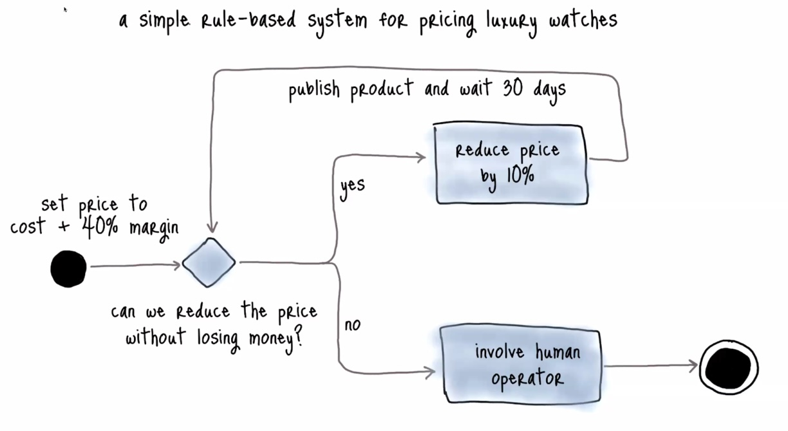
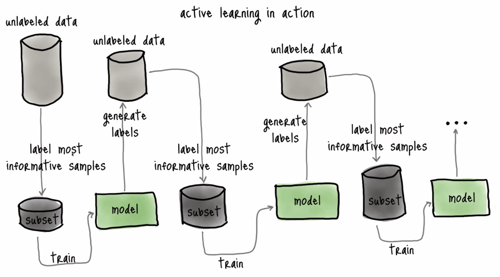
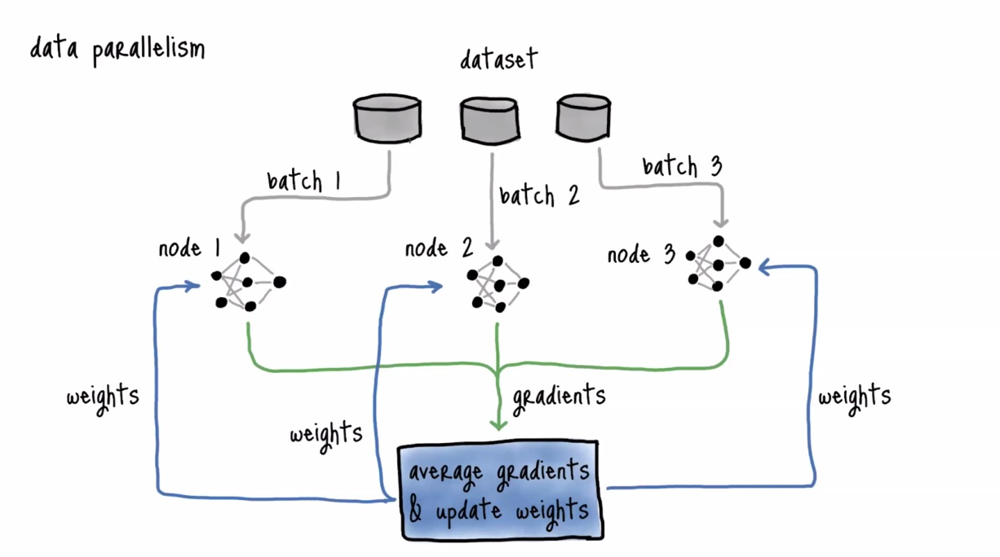
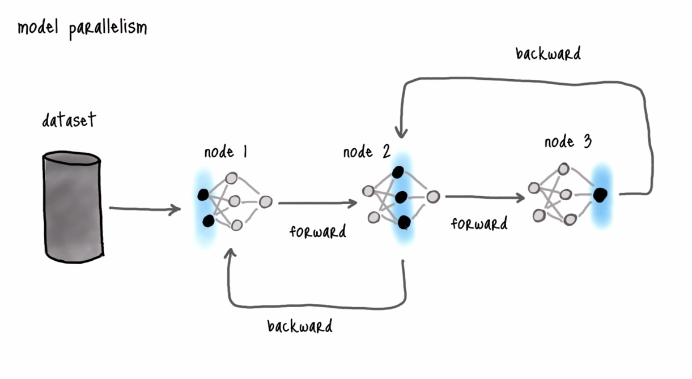
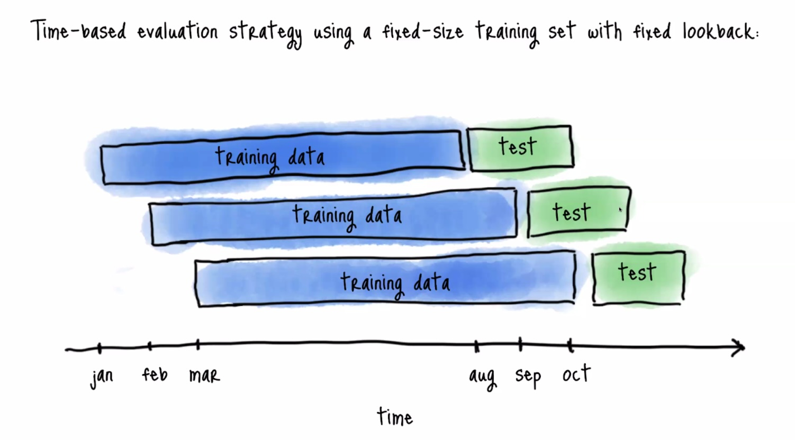
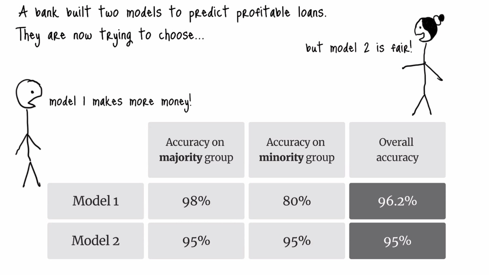
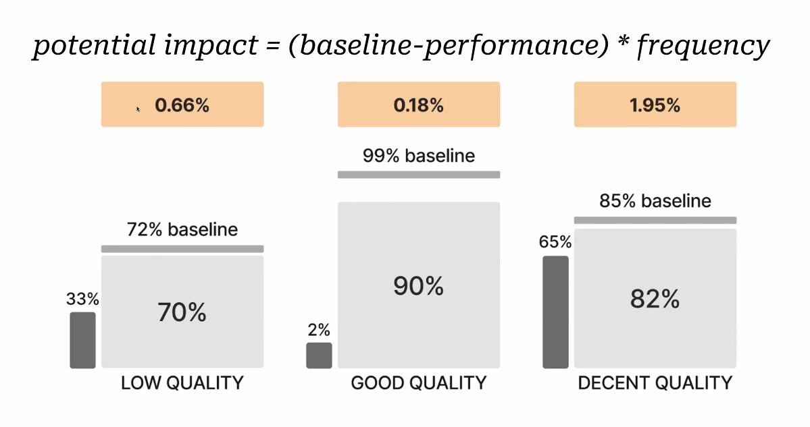

# Machine Learning School with AWS

Participants: more than 50, I think close to 100.

This guide started as a collection of notes after following the cohort-based course [Machine Learning School](https://svpino.gumroad.com/l/mlp) by [Santiago Valdarrama](https://twitter.com/svpino) .

The forked Github repository with the code is this one:

[ml.school](https://github.com/mxagar/ml.school)

I was part of Cohort 10: 2024-01.

I have the slides and links to the videos locally, but not committed to the repository:

- Slides: [`assets/slides/`](./assets/slides/)
- Links to the session videos: [`session_videos.txt`](./session_videos.txt)
- Links to the code walkthroughs: [`session_videos.txt`](./session_videos.txt)

All in all, this repository contains only my personal notes, it's not the entire content of the course; additionally, I think ML School was more than a course, it is a community of ML practitioners.

## Session 1, 2024-01-08, Monday, 16:00-18:30 CET

Code is already given, as well as walkthroughs!
Discord > Server Guide Archive.

All sessions are recorded!
He plans to edit them to concise clips, but that comes later in March

Sessions should be packed with signal, but he'll just provide the doors: we need to open them!

He wants to focus on the things that will be still used in 10 years.
Timeless ideas.

We need to unlearn what ML is
- books focus 80% on algorithms
- but the engineer focuses 80% on the data!

Structure of the program
	
1. Live sessions: interactive!
2. Code walkthroughs
3. Assignments:
    - There is also a class project
    - Recommendation: Team-up, 2-3 people max.
    - He's not reviewing any of these!

Feynman approach: he had a notebook where he wrote all the things he didn't understand. While doing so, he dissected every single part of the concepts he wrote down in that notebook.

You don't want to solve the wrong project; start every project asking 5 questions:

1. What is the problem we are trying to solve?
    - understand scope
    - identify every related problem we won't solve

2. Why is solving this problem important?
    - provide context, priorities
    - justify investments for solution

3. What do existing solutions look like?
    - learn from past experiences: best practices, pitfalls, opportunities to improve

4. What does the available data look like?
    - many companies who want to start doing ML, they don't even have the dataset yet!
    - identify quality issues and potential biases

5. How do we measure success?
    - We need to have a benchmark to assess where we want to go
    - We need to understand the answer to all these 5 questions perfectly!
    - Then, we know how to frame the problem to solve it.
    - We want to frame the problem so that we are successful at solving it; following Naval, we want to frame the problem so that we successfully solve it in 999/10000 universes, i.e., without luck.
    - A great strategy to find solutions to complex problems is to use *inversion*: turn the problem upside-down to think about it differently.
        - Instead of finding the needle in the haystack, make the haystack as small as possible.
        - Instead of being very intelligent, try not to be stupid.

Book Recommendations:

- Designing Machine Learning Systems
- Human in the Loop Machine Learning
- Interpretable Machine Learning

The first rule in machine learning: never start a project with ML, but just with the simplest thing that could possibly work.

Simple ideas are better than clever ideas. ML is a clever solution; a better alternative is to use simple solutions:
	
- prefer regex to LLMs
- prefer logistic regression to transformers
- etc.

Example: used luxury watches: set their price and sell them; which price?

- In reality, we don't know if we are leaving money on the table; so a simple approach is to set a price and iteratively change it to see how the demand reacts.
- Another ruthless approach to simplicity is to become the software (Paul Graham): allow the person to be able to do what the model would do. That goes against scalability, but it doesn't matter; the scalability issue comes later.
- A simple system serves as a baseline!
    - They give early feedback.
    - They provide access to real production data.

Collect the data! There are no datasets in the real world; if we have a curated dataset, we should not trust it, because the chance of it not representing the production data is usually high.

Questions related to data:

1. How much data do we need?
		
    Start with enough data to build and evaluate a model.
    Only go and collect more data if after evaluating the model, we see that extra data adds more value.
    Learning curves are useful for that.
    We can also try different training sizes and see how the model evaluates. Maybe we see that there is a plateau after a dataset size after which it makes no sense to increase the data.
    Also, we need to we aware of the quality of the data we are adding: are these insignificant samples, or valuable ones?
	
2. How can we source it?
		
    Selection bias is important; it is impossible to prevent. If the data in production is different to the data used during training, the model behaves unexpectedly!
    Common causes of selection bias:
    - time: when the data was taken, the time-point changes the context
    - location: where the data is taken; obviously, we cannot collect data everywhere in the world, so we need to select
    - demographics: is the people involved in the data different? maybe the people we collect data from are younger than the real users?
    - response bias: every questionnaire gave Hillary Clinton as the winner, but Trump won; obviously, the participants did something different in the real moment

    If we collect the data, collect also the meta-data that explains an contextualizes your data! Example: day and time, place, camera used, temperature, etc. Those information is critical to test for selection bias.

3. How do we structure the data?

Models can't learn without ground truth: we need to label the data to train the model; then, the models are hopefully able to generalize.

Bad quality labels are much worse than unlabelled data!

Check the library [Cleanlab](https://github.com/cleanlab/cleanlab).

- The library can help us find labeling mistakes

It is sometimes not a good idea to outsource the labeling; human annotations are very expensive, but produce better quality results.

A way to scale labeling is to use weak supervision: use rules and support models to predict the labels.

Weak supervision is very fast and inexpensive, but not always works: if it worked always, why would we need ML?

Sometimes the labels from weak supervision labeling and inaccurate, etc.

Active learning is another approach to labeling.

- Sample a little bit of data.
- Train a model.
- Predict labels on unseen subest.
- From that predicted subset, pick a sample, the ones which aremost informative.
- Label that picked subset, train a new model.
- Predict unlabeled data, again.
- Repeat the process.
- In each iteration, we are adding new samples.
- The samples we add are the most informative ones!
- Which are the most informative ones?
- Random sampling: pick random samples; that's not really a subset of most informative samples.
- Uncertainty sampling: data-points the model is not sure about, i.e., samples that are close to decision boundaries. A cat that looks like a dog.
- Diversity sampling: identify samples that are not usual, i.e., underrepresented data-points. Edge cases, e.g., a dog which is swimming.
- We need to combine both uncertainty sampling and diversity sampling.

### Interesting Links

Links from other students:

- [ML system design: 300 case studies to learn from](https://www.evidentlyai.com/ml-system-design)
- [Free Generative AI & Large Language Models Courses](https://learn.activeloop.ai)

## Session 2, 2024-01-10, Wednesday, 16:00-18:45 CET

Participants: around 50 people.

Where we talk about building models.

Heuristics: Lawyers usually pick cases where they only can win.

The most important steps when **pre-processing** data:

- Vectorization: for instance, text needs to be converted into numbers, i.e., a vector or embedding.
    - Example: CLIP from OpenAI; with it you can create embeddings for images and text and both belong to the same space! That makes possible, among other things, to perform semantic search, i.e., we look for pictures using text.
    - Encoding is a type of vectorization: label encoding, one-hot encoding.
        - label encoding creates a hierarchy or order; that can be an issue.
        - one-hot encoding doesn't create any order, but the features increase and we end up with sparse vectors.
- Normalization: map to a similar range all feature values; probably, it has no disadvantages?
    - Standardization is also a type of normalization, but in that case the mean is shifted to 0 and the variance scaled to 1.
    - Santiago is not sure if it is compulsory to have Gaussian distributions to use normalization of standardization; actually, I think there are probably much bigger issues than that.
- Handle the missing values:
    - Ignore rows/samples with many missing features/columns
    - Ignore columns/features with many missing samples/rows
    - Fill in with most common/frequent values, mean, 0, etc.
    - We can also train a model which predicts the missing values.

Then, we start doing **feature engineering**, which is the single biggest impact on model performance.

Metaphor: we start with an egg and we get a chick; that's what feature engineering does, it discovers the real value of the data.

Some examples of feature engineering:

- Splitting dates: from a date, we get days until something (e.g., Christmas), weekday, month, etc.
- Polynomial features.
- Binning: we transform continuous features to discrete ones.
- Apply clustering: assign cluster ids to samples; we leverage unsupervised learning.

Feature engineering is fundamental; when deep learning came along, people thought feature engineering wasn't important anymore -- but that's false!

Modeling: we should start with rule-based algorithms and scale up to machine learning  models:

- Sometimes rule-based algorithms are fine; the issue with them is that their scope of data is very limited.
- When we see the rule-based model is not enough for the data distributions we have, we can consider using ML.
- We should start with simple ML models! Then, we start increasing the complexity, if required. We can increase the complexity in many ways: Deep Learning, ensemble models/schemes, etc.

I understand the overall application of framework needs to be constructed so that we can easily replace the algorithms beneath: rule-base, ML, complex ML, etc.

What is a simple model? The simplicity has two aspects:

- Simple structure/architecture: linear regression.
- Simplicity of use: OpenAI APIs; the models behind are complex, but the APIs are very easy to use!

Santiago means simple to use models; he's concerned by the application complexity.

The ultimate goal is to build a model with predictive power (i.e., more than random guessing); first, establish a baseline and then beat it. A simple baseline consists in random-guessing of the zero-rule algorithm:

- Zero-rule algorithm: predict the majority class or mean/median in a regression problem.
- The baseline is essential, because sometimes only by random-guessing we can get a 90% accuracy!

We work with two hypotheses:

1. Inputs can predict outputs.
2. Data is informative enough to learn the relationship between inputs and outputs.

However, in real life, those hypotheses are not always true! Sometimes the data is not predictive! That's the difference to courses.

Therefore, we should build the application so that the model can be replaced; we want to fail as soon as possible.

We should consider the model capabilities; consider all these aspects:

- How sensible is the model to outliers?
- Training time: how long does it take? 
- Hardware constraints: edge devices require lightweight models! Always be aware of the model sizes, e.g. [Keras Models](https://keras.io/api/applications/).
- Model scalability: with time, we'll get more data, wider distributions; how will the model react to that?
- Model interpretability: anything that makes predictions that affects to human beings needs to be interpretable in one way or the other.
- Consider starting with something you know or your team knows! You're going to be much faster!
- Nothing replaces systematic experimentation. Try it!

Word of caution: Be careful with state-of-the-art (SOTA) models! Academia plays games to win stupid prizes; most such models are experiments that maybe work in niche situations.

After we choose a small model that beats baseline and achieves predictive power, it's time to start iterating on it to achieve **generalization**: that's a play between **overfitting** and **regularization**:

- Overfitting is not necessarily bad: it shows that our model can learn patterns; if we cannot overfit our model we're not sure if we can even learn something!
- Once we overfit with our training set, we can start with the regularization, which consists in reducing the model complexity so that it can generalize better.
- Hyperparameter tuning is also important here; here, **experiment tracking** is important. Hyper parameter tuning (we need to use a tool for that):
    - Grid search and random search.
    - Bayesian optimization.

**Experiment tracking** lets us recreate and compare different experiments. We need to use a tool for that! Comet ML is the tool that Santiago has used for long; it's free and very simple to use. Check the link in the resources. Other tools: Weights & Biases, MLflow.

Some insights:

- Your model will eventually overfit the test set; every time we use feedback from our evaluation to tune our model, we are increasing the variance capture!
- When data is valuable but scarce, a great strategy is to evaluate the model first, then retrain it using all available data (i.e., including test and validation); however, evaluating the model again doesn't make sense! We just simply don't evaluate the model again after that last training.

Fun fact: historians write history when they know how the events finished; the real history, when it's happening and it's reported in the newspapers is much noisier. That's called hindsight bias, which is a big issue. Similarly, we should set aside the test data without looking at it to avoid hindsight bias; some people even argue that the test set should be used only once and not touched anymore! **Data leakage** is a serious problem: is the test data affects the model, the model will perform embarrasingly!

Andrew Ng had to retract a paper once because they realized they used a leaky validation strategy: data from patients in the train set was used in the test set; then, the risk is that the model learns to identify the patient and decides according to that!

**Distributed training**: we take full advantage of our hardware; there are several approaches:

- **Data parallelism**: replicate same model across multiple nodes and train each replica with a slice of the dataset; then, models are blended (gradients are averaged?).
- **Model parallelism**: a part of the model is trained in a different node using the entire dataset. This is more complex.

Santiago is unsure how all this is implemented; he points to the Tensorflow & Pytorch documentation.

## Office Hours 1, 2024-01-11, Thursday, 16:00-17:45 CET

Less people in the sessions (around 20-30 persons), we can ask whatever we want, related to the code or the sessions.

Santiago shared his VSCode with the code from the project repository: [ml.school](https://github.com/mxagar/ml.school).

## Session 3, 2024-01-12, Friday, 16:00-18:45 CET

Main message in this session: spend time evaluating the model; we should analyze the model performance overall and in slices, and then we should perform a proper error analysis.

The stakeholders want many goals, which might be in conflict!

- Make it accurate
- Make it cheap
- Make it fast
- Make it rich

Thus, we need to work closely with the business people already in the beginning to design the metrics.

If you try to evaluate a model with the wrong metric, we failed; example: *fraud detection*. In that case, the accuracy as a metric very bad, because most of the transactions are not fraudulent. Our goal would be to minimize the false negatives! Thus, we need to focus on the Type II error, i.e., *recall*.

After picking the metric, we need to define the validation strategy:

- Holdout set: validation split used to evaluate, not used to train.
- Cross-validation: split the train split into k folds; every k training iteration, we use a different fold to validate the model.

When the validation is done, texting must be done. Usually, books and courses suggest using a random test split; in practice we should carry out **backtesting**: we use the last data in time for testing, and the previous data in time for training.

The main ideas here are:

- The test split cannot have been seen by the model.
- It's better if we take data from the future to test the model. That way, we can see the impact of time on our model.

In the figure above, each of the 3 trainings is training the model from scratch.

Similarly, we can apply this idea to other configurations. For instance, if the data comes from different sources or locations, maybe we can set aside the data from a location; that way, we use that data for testing. That shows us the bias of each location!

To evaluate the fairness of the data, the best strategy is to introduce controlled changes and check which are the outputs. There is a big issue in the US with the race: many models learn to reject loans depending on the race.

Along this lines, we should also evaluate the model metrics in stratified groups; focusing only on the total/average metric score might be a huge error:

In the figure above, if we choose model 2, we are screwing a minority group; if we choose model 1, the overall metric is worse (less profit). So the decision depends on the use-case or business problem.

Therefore, we need to look into slices of data and see how the model behaves with each slice.

Santiago emphasizes the need of a correct AI ethics discipline.

We also need to be aware of data paradoxes and pitfalls, e.g., the **Simpson Paradox**. Again, data slicing is very important; global metrics might hide the opposite insights!

Note: we need to identify the slices or subsets; for that, we can:

- Use our knowledge.
- Apply error analysis: have a look at the FP & FN samples (incorrect predictions).

**Error analysis** increases our output significantly! Example: image classification. I check the incorrect samples; then, I decide to tag all images with an additional label: good quality, decent quality, low quality. After that, I have a data slicing and evaluate the metric performance on each slice:

On which part should we focus (see the figure)? We need to look at

- The **baseline** to take a decision; the baseline in our case is the human performance.
- The weight or **frequency** of each slice.

A weighted difference of the baseline and the slice performance is the value we need to consider: we pick to focus on the slice which has the largest difference.

Instead of picking the quality tag/label, we can do similar other things:

- We can observe the images/samples and realize that they have some characteristics in common, e.g., images that were taken by a phone, or images on rainy days, etc.
- We can apply some clustering algorithms to annotate in a weakly supervised manner the samples and use the clusters as slices.

The vast majority of the data in the real world is **imbalanced**; and, usually, the interesting class is the minority one (fraud, sickness, etc.). Handling imbalanced data:

- Use stratification.
- We could try weights.
- In general, try to avoid any other strategies:
    - Oversampling.
    - Undersampling.
    - SMOTE.
    - The reason is that we want to learn the distribution of our data!

Also, when we have imbalanced datasets, we should consider performing **anomaly detection**:

- Autoencoders
- Siamese Networks
- Generate embeddings and compare them: learn to create embeddings of good doors; if we pass a broken door, the embedding should be far away from the rest.

**Data augmentation**: the main advantage is that  we expose the model to synthetic data with other characteristics, so the model becomes more general. However, don't mix data augmentation with oversampling: we need to apply changes and if possible, to all images/samples.

New data augmentation technique he's learned about recently: **MixUp**. It consists in generating synthetic images by blending existing samples at different opacities and turning the discrete labels into continuous labels! The model becomes more robust to unseen samples!

A way to augment text is to use back translation:

- Orginal: "Food was great."
- Translation: "Muy buena la comida".
- Back-translation (augmentation): "The food was fantastic."

Another way for text are templates: take a sentence and pick 2 words in it; then, for each word, other possible words that could fit into the sentence are defined. Finally, we combine all of them.

Debugging: Find the video by Karpathy where he explains how he develops neural nets, very interesting!

